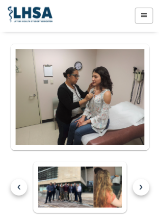
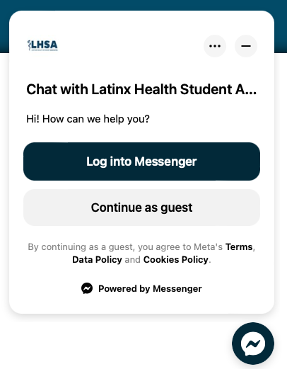
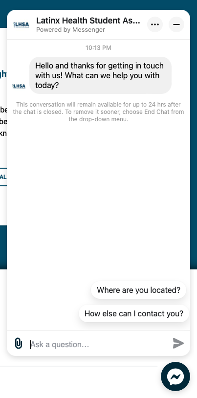

# LHSA_Club_Site
Website for the Latinx Health Student Association. LHSA is a club at the University of Arizona made to gather resources, information, and advice for Latino students looking to apply to medical school.

Website was made entirely from vanilla HTML, CSS, Javascript, and PHP. It does not use any frameworks or plugins. All components are entirely custom made.

Custom components include:
- Google Calendar integration
- Accordians
- Responsive navigation menu
- Slideshow with carousel

Extras include:
- Facebook chat integration
- Google Maps integration

## Feature Highlights

### Google Calendar Component | PHP, AJAX, Javascript
- Uses Google Calendar API
- Uses Google's Oauth to authenticate calendar account
- Acccesses a google calendar feed and extracts details for a single or multiple events including:
    - date
    - time
    - location
    - event description
- Extracted details are custom styled
- Fully responsive for desktop and mobile layouts

| Desktop view | Mobile view |
| ----------- | ----------- |
|  |  |

### Navigation Menu
- Menu navigation is fully respnosive to large and small screens
- On large screens it expands to show full links to all pages 
- on small screens, links collapse into a hamburger menu which can be used to open up a menu containing page links

| Desktop Navigation | Mobile Navigation |
| ----------- | ----------- |
|  |  |

### Accordion Component | HTML, CSS, Javascript
- Fully responsive for large and small screens. On large screens accordions are automatically expanded to take advantage of the increased space. On small screens such as mobile, accordions are collapsed to allow the user to selectively choose what information they would like to view. 

#### Desktop Screenshots
| Expanded view on desktop | Collapsed view on desktop |
| ----------- | ----------- |
|  |  |

#### Mobile Screenshots
| Expanded view on mobile | Collapsed view on mobile |
| ----------- | ----------- |
|  |  |

### Slideshow With Carousel
- Slideshow is meant to showcase photos of most exciting events. The user can switch between photos using the next and previous buttons integrated into the carousel below it
- the carousel also contains thumbnails of all the available images in the slideshow

| Expanded view on mobile | Collapsed view on mobile |
| ----------- | ----------- |
|  |  |

## Extra Features

### Facebook Chat integration
- The club already had a facebook page. Facebook chat plugin was integrated so site visitors could automatically engage with club members and ask frequently asked questions. 
- chat integration was customized with color to fit with the sites overall aesthetic and brand

|  |  |

### Google Maps Integration
- Google maps embeds were used to show where the club meets on different occasions. Maps are completely interactable and allow user to zoom in on specific streets or get gps directions.
- embed was made fully responsive for large and small screen sizes

### Google My Maps Integration
- Google My Maps embed was also used to create a custom map showing available parking locations and details of said locations to club events.
- embed was made fully responsive for large and small screen sizes
